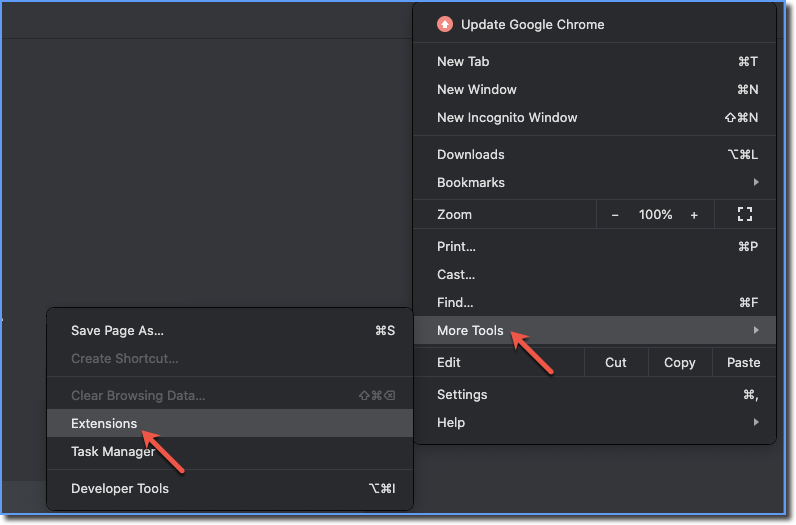

# GitHub BPMN Visualizer

github-bpmn-visualizer is a tool to visualize BPMN files on GitHub.

## Installation

### Chrome WebStore
Look for the extension on the [Chrome WebStore](https://chrome.google.com/webstore/).

URL to be added.

App ID: dmikngfoggnleopoclglgoidlohnjmfe

### Manual
1. Open your Chrome browser and go to the Extensions page.

2. Make sure the Developer Mode is enabled.

3. Click the Load unpacked button.

4. Select and upload the extracted folder.
